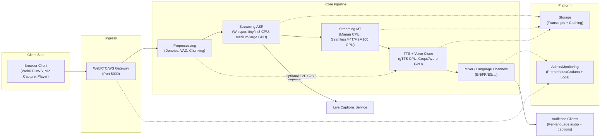
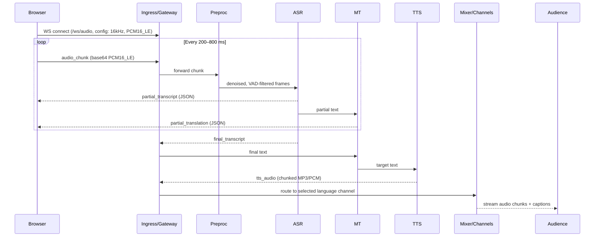

## Live AI Interpreter — Architecture & Design

This document describes the architecture, data flow, interfaces, UX, deployment, and monitoring for the “Live AI Interpreter.” It targets Windows 10 (CPU-only, Python 3.12) for development and GPU servers for production. Defaults: server port 5000, sample_rate 16000 Hz, mono PCM16_LE audio. Primary entrypoint: `backend/main.py`.

### 1) Executive Summary
- Captures live speech and converts it to text (ASR), translates it (MT), and speaks it back (TTS) in near real-time.
- Business value: multilingual meetings/classrooms where audiences hear their preferred language instantly with live captions.
- Key success metrics: end-to-end latency (<2s GPU, <6s CPU), ASR WER, MT quality, TTS naturalness, and user NPS.
- Modular design: CPU-friendly for dev; GPU acceleration, scaling, and per-language channels for production.
- Easy adoption: simple Web UI, WebSocket streaming, and REST health/session APIs.

### 2) High-Level Architecture Diagram



The browser sends audio via the gateway, which feeds a preprocessing stage, then ASR→MT→TTS, and finally per-language channels. Captioning and storage/monitoring operate in parallel.

### 3) Component Descriptions
- Client (Browser UI): Captures mic audio, sends PCM16_LE chunks over WS, receives TTS audio/text to play/display; includes language selector, captions, and latency indicator.
- Ingress / WebRTC Gateway: Handles browser connections (WS/WebRTC), rate-limits, consent/auth, and forwards streams into the backend pipeline.
- Preprocessing (Noise Suppression, VAD, Chunking): RNNoise/WebRTC NS for denoise; VAD for speech/silence; packs 200–800 ms chunks.
- Streaming ASR: Dev (CPU): faster-whisper tiny/int8; Prod (GPU): medium/large fp16; streaming/sliding window emits partial/final transcripts.
- Streaming MT: Dev (CPU): MarianMT small; Prod (GPU): M2M100/SeamlessM4T; supports partial translation and segment refinement.
- Streaming TTS + Voice Cloning: Dev (CPU): gTTS; Prod (GPU): Coqui XTTS/Azure CNV; outputs small audio chunks for immediate playback.
- Mixer / Audio routing / Per-language channels: One channel per target language; audio multiplexing and drift correction; audience hears selected language.
- Diarization & Speaker Embeddings: Speaker detection (pyannote/Resemblyzer); speaker tags in captions; optional embeddings for voice cloning.
- Storage & Vector DB: Stores transcripts, timings, language tags; caches repeated phrases; optional vector search for glossary.
- Admin / Monitoring / Logging: Prometheus metrics, Grafana dashboards, optional tracing, structured logs (ELK).

### 4) Data Flow & Sequence Diagram



This sequence shows partial and final flows for a short utterance. If TTS is delayed, captions serve as a fallback so users keep context.

### 5) API Contracts

OpenAPI-style pseudo YAML (REST):

```yaml
openapi: 3.0.0
info:
  title: Live AI Interpreter
  version: 0.1.0
servers:
  - url: http://localhost:5000
paths:
  /health:
    get:
      summary: Health check
      responses:
        '200': { description: OK }
  /session/create:
    post:
      summary: Create a session
      requestBody:
        required: false
      responses:
        '200': { description: Created }
  /session/status:
    get:
      summary: Session status
      responses:
        '200': { description: OK }
```

WebSocket `/ws/audio` message formats (JSON over text + base64 for audio):

- Control (start):
```json
{ "type": "start", "sample_rate": 16000, "channels": 1, "chunk_ms": 400, "audio_format": "PCM16_LE" }
```

- Audio chunk (base64 PCM16_LE mono):
```json
{
  "type": "audio_chunk",
  "seq": 42,
  "ts_ms": 1710001234567,
  "sample_rate": 16000,
  "channels": 1,
  "audio_format": "PCM16_LE",
  "chunk_ms": 400,
  "audio_b64": "<BASE64_PCM16>"
}
```

- Heartbeat:
```json
{ "type": "heartbeat", "ts_ms": 1710001234567 }
```

- Partial transcript:
```json
{ "type": "partial", "text": "namaste", "lang": "hi", "translation": "Hello", "target_lang": "en" }
```

- Final transcript + translation:
```json
{
  "type": "final",
  "text": "namaste sabko",
  "lang": "hi",
  "translation": "Hello everyone",
  "target_lang": "en",
  "speaker": "S1",
  "confidence": 0.86
}
```

- Synthesized audio (base64 MP3 or PCM):
```json
{ "type": "tts_audio", "mime": "audio/mpeg", "seq": 42, "audio_b64": "<BASE64_MP3_CHUNK>" }
```

- Error:
```json
{ "type": "error", "code": "ASR_TIMEOUT", "message": "ASR stalled" }
```

Config defaults: `port=5000`, `sample_rate=16000`, `channels=1`, `chunk_ms=400`, `audio_format=PCM16_LE`.

### 6) Frontend UX / Wireframes

Wireframe (text):
- Top bar: session name, live latency indicator
- Left: video/participant list, active speaker highlight
- Center: captions area (source + translation, live updating)
- Right: language selector (EN/FR/ES/..), per-language audio playback controls
- Bottom: mic mute/unmute, join/leave, consent status

Sample `index.html` (simple demo UI):

```html
<!DOCTYPE html>
<html>
  <head>
    <meta charset="utf-8" />
    <meta name="viewport" content="width=device-width, initial-scale=1" />
    <title>Live AI Interpreter</title>
    <link rel="stylesheet" href="/static/style.css" />
  </head>
  <body>
    <div class="bar">
      <span>Session: Demo</span>
      <span id="latency">Latency: -</span>
    </div>
    <div class="main">
      <div class="left">Participants</div>
      <div class="center">
        <div class="cap cap-src" id="capSrc"></div>
        <div class="cap cap-tgt" id="capTgt"></div>
      </div>
      <div class="right">
        <select id="lang">
          <option value="en">English</option>
          <option value="es">Spanish</option>
          <option value="fr">French</option>
        </select>
        <audio id="player" autoplay controls></audio>
      </div>
    </div>
    <div class="controls">
      <button id="start">Start</button>
      <button id="stop" disabled>Stop</button>
    </div>
    <script src="/static/app.js"></script>
  </body>
  </html>
```

Sample `style.css`:

```css
body { font-family: system-ui, Arial, sans-serif; margin: 0; }
.bar { display:flex; justify-content:space-between; padding:8px 12px; background:#f5f5f5; }
.main { display:grid; grid-template-columns: 200px 1fr 240px; gap:12px; padding:12px; }
.cap { min-height:28px; padding:8px; border-radius:6px; margin:6px 0; }
.cap-src { background:#eef; }
.cap-tgt { background:#efe; }
.controls { padding:12px; border-top:1px solid #eee; }
```

Sample `app.js` (WS handling + audio send/playback):

```javascript
const WS_URL = (location.protocol === 'https:' ? 'wss://' : 'ws://') + location.host + '/ws/audio';
let ws, mediaStream, audioCtx, source, processor, recording = false;
const player = document.getElementById('player');
const capSrc = document.getElementById('capSrc');
const capTgt = document.getElementById('capTgt');

function f32ToPcm16Base64(f32) {
  const i16 = new Int16Array(f32.length);
  for (let i=0;i<f32.length;i++) {
    const s = Math.max(-1, Math.min(1, f32[i]));
    i16[i] = s < 0 ? s * 0x8000 : s * 0x7FFF;
  }
  return btoa(String.fromCharCode(...new Uint8Array(i16.buffer)));
}

function playMp3(base64) {
  const bytes = Uint8Array.from(atob(base64), c => c.charCodeAt(0));
  const blob = new Blob([bytes], { type: 'audio/mpeg' });
  const url = URL.createObjectURL(blob);
  player.src = url;
}

async function start() {
  if (recording) return; recording = true;
  ws = new WebSocket(WS_URL);
  ws.onopen = () => ws.send(JSON.stringify({ type: 'start', sample_rate: 16000, channels: 1, chunk_ms: 400, audio_format: 'PCM16_LE' }));
  ws.onmessage = (ev) => {
    try {
      const msg = JSON.parse(ev.data);
      if (msg.type === 'partial') { capSrc.textContent = msg.text || ''; capTgt.textContent = msg.translation || ''; }
      if (msg.type === 'final')   { capSrc.textContent = msg.text || ''; capTgt.textContent = msg.translation || ''; }
      if (msg.type === 'tts_audio') { playMp3(msg.audio_b64); }
    } catch (_) {}
  };

  mediaStream = await navigator.mediaDevices.getUserMedia({ audio: { sampleRate: 16000, channelCount:1, echoCancellation:true, noiseSuppression:true }});
  audioCtx = new (window.AudioContext || window.webkitAudioContext)({ sampleRate: 16000 });
  source = audioCtx.createMediaStreamSource(mediaStream);
  processor = audioCtx.createScriptProcessor(4096, 1, 1);
  processor.onaudioprocess = (e) => {
    if (!recording || ws.readyState !== WebSocket.OPEN) return;
    const f32 = e.inputBuffer.getChannelData(0);
    const audio_b64 = f32ToPcm16Base64(f32);
    ws.send(JSON.stringify({ type: 'audio_chunk', seq: Date.now() % 1e9, ts_ms: Date.now(), sample_rate: 16000, channels: 1, audio_format: 'PCM16_LE', chunk_ms: 400, audio_b64 }));
  };
  source.connect(processor); processor.connect(audioCtx.destination);
}

function stop() {
  recording = false; if (processor) processor.disconnect(); if (source) source.disconnect(); if (audioCtx) audioCtx.close(); if (ws) ws.close(); if (mediaStream) mediaStream.getTracks().forEach(t => t.stop());
}

document.getElementById('start').onclick = start;
document.getElementById('stop').onclick = stop;
```

Dynamic behaviors: partial transcript updates live; highlight active speaker; audience can switch language on the fly; if audio lags, captions remain; show confidence scores via tooltips.

### 7) Message Timing & Latency Strategy
- Chunk size: 200–800 ms (default 400 ms) — smaller chunks reduce latency but increase WS overhead; larger chunks improve stability.
- Partial cadence: ~300–800 ms; Final (GPU): 1–2 s; Final (CPU): 3–6 s.
- Reduction strategies: streaming ASR on short windows; incremental MT; chunked/streaming TTS; voice conversion batching; start audio playback while synthesis continues.

### 8) Error Handling & UX Fallbacks
- ASR fail/high WER: low-confidence highlights in captions, retry prompt, mic-check hints.
- MT fail: show original transcript; badge “translation delayed.”
- TTS fail: text-only captions + “download transcript” option.
- Generic errors: toast + reconnect; network backoff; local buffering.

### 9) Security, Privacy & Compliance
- Recording consent: explicit banner/checkbox; do not start streaming without consent.
- At-rest encryption: for transcripts and audio clips; retention policy (e.g., 30/90 days).
- PII masking: regex/NLP redaction; data minimization.
- GDPR: purpose limitation, user rights (export/delete), DPA, regional storage; per-participant opt-out.

### 10) Deployment & Ops (brief)
- Dev (CPU, Windows 10): `python backend/main.py` (port 5000).
- Dockerfile: CPU-only base image; production uses GPU-enabled image (CUDA) with pre-warmed models.
- Kubernetes: GPU nodes (NVIDIA A10/A100), Deployment + Service + Ingress; autoscaling by concurrent sessions/language channels; node selectors for GPU.

### 11) Monitoring & Metrics
- KPIs: end-to-end latency, ASR WER, MT error rate, TTS success rate, concurrent sessions, CPU/GPU utilization, memory, WS errors, NPS.
- Prometheus metric names:
  - `lai_ws_connections_total`
  - `lai_asr_partial_latency_ms`
  - `lai_asr_final_latency_ms`
  - `lai_mt_latency_ms`
  - `lai_tts_latency_ms`
  - `lai_e2e_latency_ms`
  - `lai_sessions_active`
  - `lai_tts_failures_total`
- Grafana dashboard: latency percentiles (p50/p90/p99), pipeline breakdown, active sessions, per-language channel load, error rates.

### 12) Testing Plan
- Unit: ASR/MT/TTS mocks; audio utils (PCM16 encode/decode), VAD thresholds.
- Integration: recorded audio utterances; verify partial cadence, final timings, non-empty translations; audio playback smoke test.
- Load: simulate X speakers, Y listeners; verify average e2e latency and no cross-channel bleed.
- Human eval: rubric for intelligibility, latency perception, translation adequacy, TTS naturalness.

### 13) Roadmap & Phases
- Phase 1: WS loopback + denoise; latency printouts. Acceptance: RTT < 100 ms LAN.
- Phase 2: Streaming ASR + VAD; partial/final JSON. Acceptance: partials < 1s.
- Phase 3: Real-time MT; multi-target languages. Acceptance: EN/ES/FR functional.
- Phase 4: Low-latency TTS (+optional voice clone). Acceptance: short phrases < 2s GPU.
- Phase 5: Per-language channels + diarization; multi-user scaling. Acceptance: 10+ channels stable.
- Phase 6: Docker/K8s, GPU deploy, monitoring, GDPR. Acceptance: k6 @100+ users, SLO met.

### 14) Deliverables
- ARCHITECTURE.md (this document) — Mermaid diagrams embedded.
- Sample snippets: `index.html`, `app.js`, `style.css` (see section 6).
- Sample WebSocket messages (JSON in section 5).
- OpenAPI YAML stub (section 5).
- README.md: Windows 10 + Python 3.12 setup; GPU notes for prod.
- Acceptance criteria (below).

### Backend WebSocket Skeleton (Runnable Snippet)

```python
from fastapi import FastAPI, WebSocket
import base64, json

app = FastAPI()

@app.websocket('/ws/audio')
async def ws_audio(ws: WebSocket):
    await ws.accept()
    cfg = { 'sample_rate': 16000, 'channels': 1, 'chunk_ms': 400 }
    try:
        while True:
            msg = await ws.receive_text()
            obj = json.loads(msg)
            if obj.get('type') == 'start':
                cfg.update(obj)
                await ws.send_text(json.dumps({ 'type': 'ack' }))
            elif obj.get('type') == 'audio_chunk':
                # audio_b64 -> PCM16 bytes
                audio_bytes = base64.b64decode(obj['audio_b64'])
                # TODO: denoise + VAD + ASR + MT
                await ws.send_text(json.dumps({ 'type': 'partial', 'text': '...', 'lang': 'hi', 'translation': '...', 'target_lang': 'en' }))
                # TODO: TTS -> send tts_audio
            elif obj.get('type') == 'heartbeat':
                await ws.send_text(json.dumps({ 'type': 'pong', 'ts_ms': obj.get('ts_ms') }))
    except Exception:
        pass
```

### Acceptance Criteria
- A developer can read ARCHITECTURE.md and understand the end-to-end flow and how to start building.
- The document contains working sample snippets for client send/play and a WebSocket server skeleton.
- An OpenAPI stub and WebSocket message formats are included.
- Performance targets and UX fallbacks are explicit.
- The README enables a Windows 10 + Python 3.12 user to install deps and run a CPU-only dev server.


